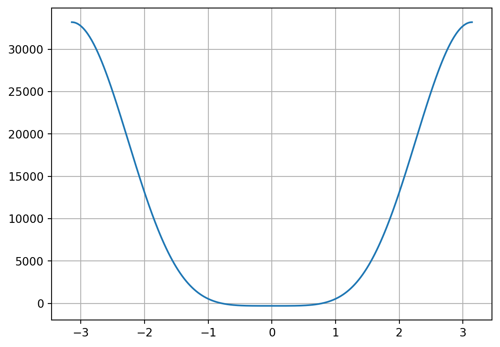
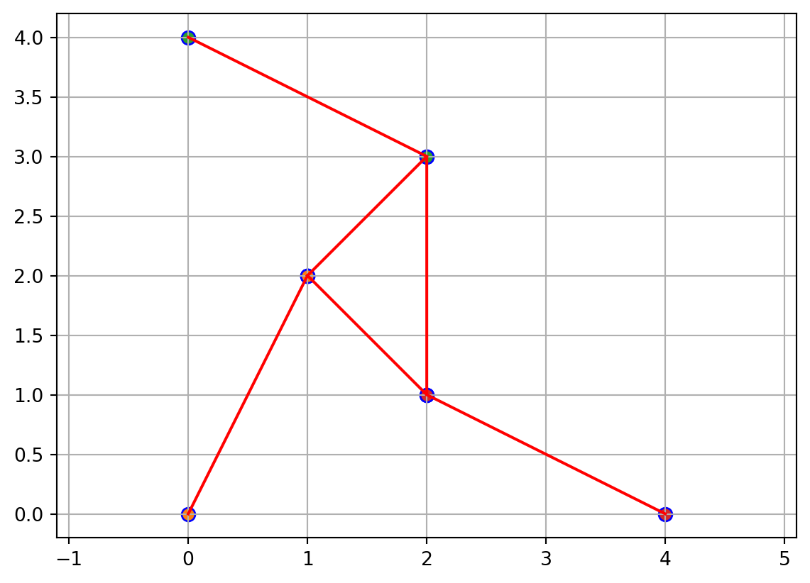
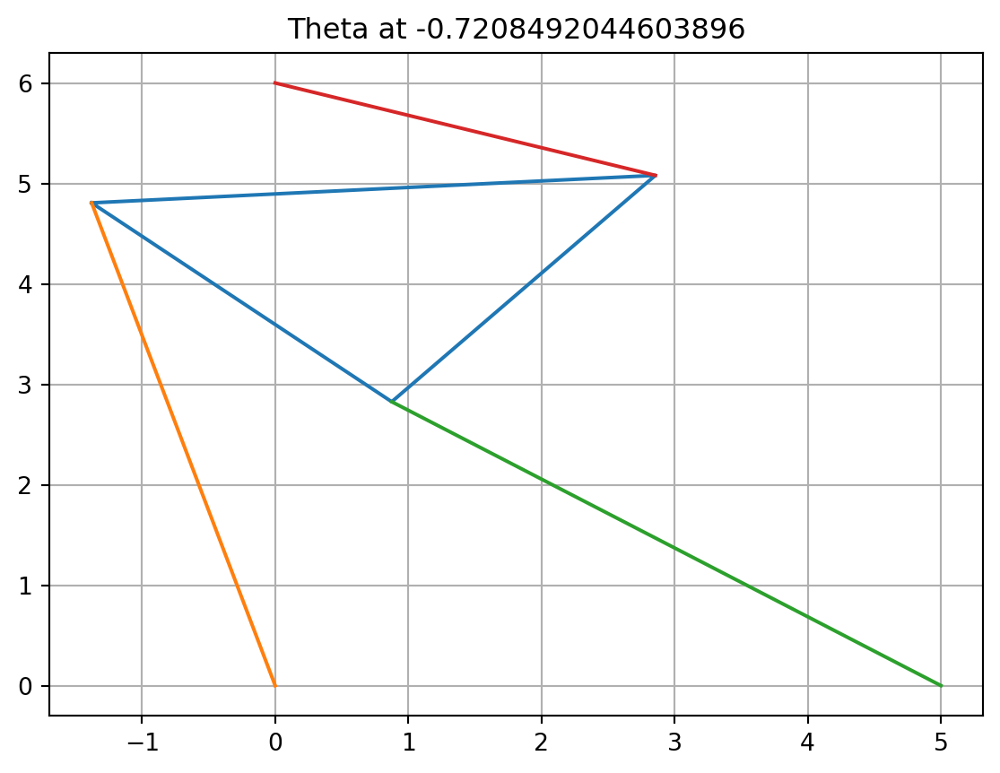
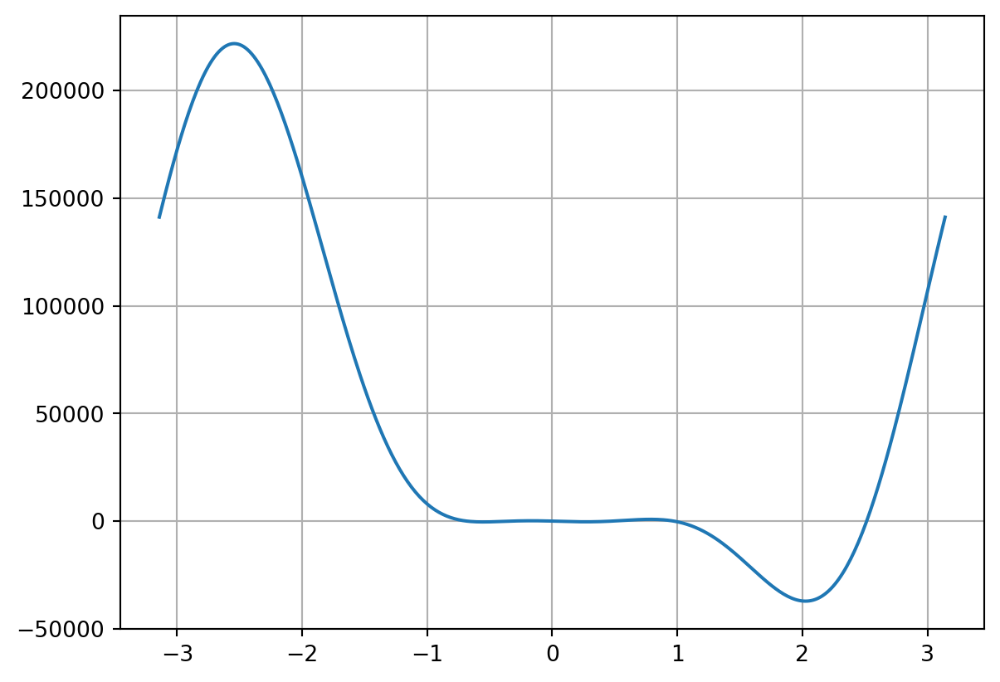
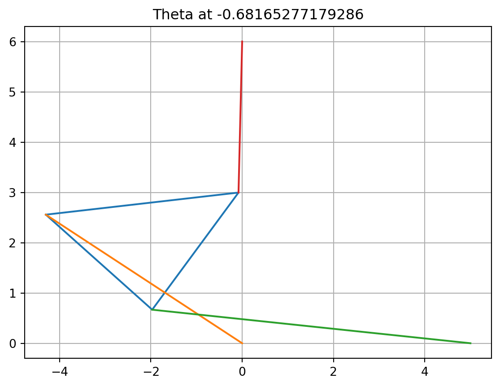
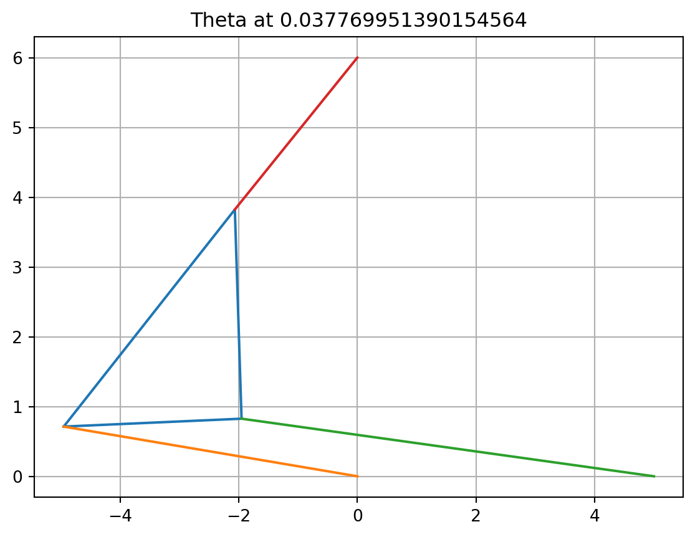

## Reality Check
Jenaveve White

## Introduction 

A Stewart platform is a versatile parallel manipulator characterized by six degrees of freedom, allowing for precise control of a mobile platform connected to a fixed base via six adjustable legs. Developed by Eric G. Stewart in the 1960s, these platforms can move freely in three-dimensional space, making them ideal for various applications, including robotics, flight simulators, medical devices, and aerospace testing. Their advantages include high precision, versatility in motion profiles, and a compact design, which enable them to effectively accommodate diverse payloads and operational requirements. Overall, Stewart platforms play a crucial role in advancing technology across multiple fields by providing sophisticated motion control solutions.


# Question 1 and 2

Write a Python function for f(θ). The parameters $L_1, L_2, L_3, \gamma, x_1, x_2, y_2 \text{ are fixed}$ constants, and the strut lengths p1, p2, p3 will be known for a given pose.

::: {#c25e8604 .cell execution_count=1}
``` {.python .cell-code}
import matplotlib.pyplot as plt
import numpy as np

L1 = 2 
L2 = np.sqrt(2)
L3 = np.sqrt(2)
gamma = np.pi /2
x1 = 4 
x2 = 0
y2 = 4 
p1 = np.sqrt(5)
p2 = p1
p3 = p1
# Question 1 
def f(theta):
    A2 = L3*np.cos(theta)-x1 
    B2= L3*np.sin(theta)
    A3 = L2*np.cos(theta + gamma) - x2
    B3 = L2*np.sin(theta+ gamma) -y2
    D = 2 * (A2* B3 - B2*A3)
    N1 = B3*(p2**2-p1**2-A2**2-B2)-B2*(p3**2-p1**2-A3**2-B3**2)
    N2 = -A3*(p2**2-p1**2-A2**2-B2)+A2*(p3**2-p1**2-A3**2-B3**2)
    return N1**2+N2**2-p1**2*D**2


theta = np.pi/4 
x_array = np.linspace(-np.pi, np.pi,400)
plt.plot(x_array, f(x_array))
plt.grid()
plt.show()


#def triangle(p1, p2, gamma, theta):
#
#    A2 = L3*np.cos(theta)-x1 
#    B2= L3*np.sin(theta)
#    A3 = L2*np.cos(theta + gamma) - x2
#    B3 = L2*np.sin(theta+ gamma) -y2
#    D = 2 * (A2* B3 - B2*A3)
#    N1 = B3*(p2**2-p1**2-A2**2-B2)-B2*(p3**2-p1**2-A3**2-B3**2)
#    N2 = -A3*(p2**2-p1**2-A2**2-B2)+A2*(p3**2-p1**2-A3**2-B3**2)
#
#    x = N1 / D
#    y = N2 / D
#
#
#    answ = [x,y, theta]
#    return answ
#
```

::: {.cell-output .cell-output-display}
{width=592 height=411}
:::
:::


# Question 3

Reproduce Figure 1.15.

::: {#83be5bac .cell execution_count=2}
``` {.python .cell-code}
def plot_triangle(point1, point2, point3, x1, x2 , y2):
    
    
    # Prepare x and y coordinates
    x = [point1[0], point2[0], point3[0], point1[0]]  # Closing the triangle
    y = [point1[1], point2[1], point3[1], point1[1]]  # Closing the triangle
    strut1x = [0, point1[0]]
    strut1y= [0, point1[1]]
    strut2x = [0, point2[0]]
    strut2y = [x1,point2[1]]
    strut3x = [x2, point3[0]]
    strut3y = [y2, point3[1]]
        
    # Create the plot
    plt.figure()
    
    plt.plot(x, y, linestyle='-', color='red')  
    plt.plot(strut1x, strut1y, linestyle='-', color='red') 
    plt.plot(strut2x, strut2y, linestyle='-', color='red')  
    plt.plot(strut3x, strut3y, linestyle='-', color='red')  


# Scatter with small open circles
    plt.scatter(x, y, marker='o', edgecolor='blue', s=50)
    plt.scatter(strut1x, strut1y, marker='o', edgecolor='blue', s=50 )
    plt.scatter(strut2x, strut2y, marker='o', edgecolor='blue', s=50 )
    plt.scatter(strut3x, strut3y, marker='o', edgecolor='blue', s=50 )


    # Set aspect ratio and limits
    plt.axis('equal')
    plt.grid()

  
#testing my triangle function
    
plot_triangle((1,2),(2,3),(2,1), 4,4,0)
plot_triangle((2,1),(1,2),(3,2), 4,4,0)
```

::: {.cell-output .cell-output-display}
{width=571 height=411}
:::

::: {.cell-output .cell-output-display}
{width=571 height=411}
:::
:::


# Question 4 

Solve the forward kinematics problem for the planar Stewart platform specified by x1 = 5,(x2, y2) = (0, 6), L1 = L3 = 3, L2 = 3√2, γ = π/4, p1 = p2 = 5, p3 = 3. Begin by plotting f(θ). Use an equation solver of your choice to find all four poses (roots of   f(θ)), and plot them. Check your answers by verifying that p1, p2, p3 are the lengths of the struts in your plot.

::: {#6cba85ca .cell execution_count=3}
``` {.python .cell-code}
from scipy.optimize import fsolve
import numpy as np
import matplotlib.pyplot as plt

import plotly_express as px

L1 = 3
L2 = 3 * np.sqrt(2)
L3 = 3
gamma = np.pi /4
x1 = 5 
x2 = 0
y2 = 6
p1 = 5
p2 = 5
p3 = 3

# Define the function f(θ) from earlier
def f(theta):
    A2 = L3 * np.cos(theta) - x1 
    B2 = L3 * np.sin(theta)
    A3 = L2 * np.cos(theta + gamma) - x2
    B3 = L2 * np.sin(theta + gamma) - y2
    D = 2 * (A2 * B3 - B2 * A3)
    N1 = B3 * (p2**2 - p1**2 - A2**2 - B2) - B2 * (p3**2 - p1**2 - A3**2 - B3**2)
    N2 = -A3 * (p2**2 - p1**2 - A2**2 - B2) + A2 * (p3**2 - p1**2 - A3**2 - B3**2)
    return N1**2 + N2**2 - p1**2 * D**2

x_array = np.linspace(-np.pi, np.pi,400)
plt.plot(x_array, f(x_array))
plt.grid()
plt.show()

def rootfinder(start, stop, num):
    initial_guesses = np.linspace(start, stop, num)  # Multiple guesses for better coverage
    roots = []

    for i in initial_guesses:
        root = fsolve(f, i)
        # Add unique roots only
        if root not in roots :
            roots.append(root)

    roots = np.array(roots).flatten()
    print("Roots found:", roots)

    # Convert roots to a more usable format
    return roots

# Print the roots
rootfinder(-np.pi, np.pi, 5)

```

::: {.cell-output .cell-output-display}
{width=600 height=411}
:::

::: {.cell-output .cell-output-stdout}
```
Roots found: [-4.08036267 -0.95420323 -0.24600057  1.09426087  2.20282264]
```
:::

::: {.cell-output .cell-output-display execution_count=3}
```
array([-4.08036267, -0.95420323, -0.24600057,  1.09426087,  2.20282264])
```
:::
:::


::: {#3f105b40 .cell execution_count=4}
``` {.python .cell-code}
import numpy as np 
import matplotlib.pyplot as plt 

L1 = 3
L2 = 3 * np.sqrt(2)
L3 = 3
gamma = np.pi / 4
x1 = 5 
x2 = 0
y2 = 6
p1 = 5
p2 = 5
p3 = 3


# Define the function f(θ) from earlier
def f(theta):
    A2 = L3 * np.cos(theta) - x1 
    B2 = L3 * np.sin(theta)
    A3 = L2 * np.cos(theta + gamma) - x2
    B3 = L2 * np.sin(theta + gamma) - y2
    D = 2 * (A2 * B3 - B2 * A3)
    N1 = B3 * (p2**2 - p1**2 - A2**2 - B2) - B2 * (p3**2 - p1**2 - A3**2 - B3**2)
    N2 = -A3 * (p2**2 - p1**2 - A2**2 - B2) + A2 * (p3**2 - p1**2 - A3**2 - B3**2)
    return N1**2 + N2**2 - p1**2 * D**2

def triangleplotting(theta):

    A2 = L3*np.cos(theta)-x1 
    B2= L3*np.sin(theta)
    A3 = L2*np.cos(theta + gamma) - x2
    B3 = L2*np.sin(theta+ gamma) -y2
    D = 2 * (A2* B3 - B2*A3)
    N1 = B3*(p2**2-p1**2-A2**2-B2)-B2*(p3**2-p1**2-A3**2-B3**2)
    N2 = -A3*(p2**2-p1**2-A2**2-B2)+A2*(p3**2-p1**2-A3**2-B3**2)
    x = N1/D
    y = N2/D
    
    #coordinate points for the triangle 
    u1 = N1/D
    u2 = x + L3 * np.cos(theta)
    u3 = x + L2 * np.cos(theta + gamma)
    m1 = N2/D
    m2 = y + L3 * np.sin(theta)
    m3 = y + L2 * np.sin(gamma + theta)

    plt.grid()
    plt.autoscale()
    #plots the inner triangle.
    plt.plot([x,u3, x + L3 * np.cos(theta),x ],[y, y + L2 * np.sin(gamma + theta), y + L3 * np.sin(theta),y ])
    
    #plots strut 1
    plt.plot([0, x],[0, y])

    #plots strut 2
    plt.plot([x1,u2 ],[0, m2])

    #plots strut 3
    plt.plot([x2, u3],[y2, m3])


#tested Triangle plot
#triangleplotting( np.pi /4)

def secant(f, x0, x1, k):
    for i in range(1,k):
        x2 = x1 - f(x1)*(x1-x0)/(f(x1)-f(x0))
        x0 =x1 
        x1 = x2
    return x2

#fig,axes = plt.subplots(2,2, figsize = 10)
plt.figure()
firsttheta = secant(f, -1, -0.7, 10)
triangleplotting(firsttheta)
#print(firsttheta)

plt.figure()
secondtheta = secant(f, -.4, -.3, 5)
#print(secondtheta)
triangleplotting(secondtheta)
#
plt.figure()
thirdtheta = secant(f, 1, 1.2, 5)
triangleplotting(thirdtheta)
#
plt.figure()
fourththeta = secant(f, 2, 2.2, 5)
triangleplotting(fourththeta)
```

::: {.cell-output .cell-output-display}
{width=558 height=411}
:::

::: {.cell-output .cell-output-display}
{width=558 height=411}
:::

::: {.cell-output .cell-output-display}
{width=558 height=411}
:::

::: {.cell-output .cell-output-display}
{width=558 height=411}
:::
:::


# Question 5 
Change strut length to p2 = 7 and re-solve the problem. For these parameters, there are six poses

::: {#80920f15 .cell execution_count=5}
``` {.python .cell-code}
p2 = 7

x_array = np.linspace(-np.pi, np.pi,400)
plt.plot(x_array, f(x_array))
plt.grid()
plt.show()

g1 = secant(f,-.7, -.6, 3)
g2 = secant(f,-.4, -.3, 3)
g3 = secant(f,0, .1, 3)
g4 = secant(f,.2, .5, 3)
g5 = secant(f,.9, 1.1, 3)
g6 = secant(f,2.3, 2.6, 3)

plt.figure()
triangleplotting(g1)
plt.figure()
triangleplotting(g2)
plt.figure()
triangleplotting(g3)
plt.figure()
triangleplotting(g4)
plt.figure()
triangleplotting(g5)
plt.figure()
triangleplotting(g6)

```

::: {.cell-output .cell-output-display}
{width=603 height=411}
:::

::: {.cell-output .cell-output-display}
{width=558 height=411}
:::

::: {.cell-output .cell-output-display}
{width=558 height=411}
:::

::: {.cell-output .cell-output-display}
{width=558 height=411}
:::

::: {.cell-output .cell-output-display}
{width=558 height=411}
:::

::: {.cell-output .cell-output-display}
{width=558 height=411}
:::

::: {.cell-output .cell-output-display}
{width=558 height=411}
:::
:::


# Question 6 
Find a strut length p2, with the rest of the parameters as in Step 4, for which there are only two poses.

::: {#c3c76db6 .cell execution_count=6}
``` {.python .cell-code}
p2 = 0

x_array = np.linspace(-np.pi, np.pi,500)
plt.plot(x_array, f(x_array))
plt.grid()
plt.show()

rootfinder(-np.pi, np.pi, 10)

```

::: {.cell-output .cell-output-display}
{width=600 height=411}
:::

::: {.cell-output .cell-output-stdout}
```
Roots found: [-4.97821343  1.30490762  1.30490024  1.30576139  1.30541648  1.30200921
  1.30491879  1.30476176  1.30480726  1.30497186]
```
:::

::: {.cell-output .cell-output-stderr}
```
C:\Users\Jenaveve\AppData\Local\Programs\Python\Python311\Lib\site-packages\scipy\optimize\_minpack_py.py:177: RuntimeWarning:

The iteration is not making good progress, as measured by the 
  improvement from the last ten iterations.

C:\Users\Jenaveve\AppData\Local\Programs\Python\Python311\Lib\site-packages\scipy\optimize\_minpack_py.py:177: RuntimeWarning:

The iteration is not making good progress, as measured by the 
  improvement from the last five Jacobian evaluations.

```
:::

::: {.cell-output .cell-output-display execution_count=6}
```
array([-4.97821343,  1.30490762,  1.30490024,  1.30576139,  1.30541648,
        1.30200921,  1.30491879,  1.30476176,  1.30480726,  1.30497186])
```
:::
:::


# Question 7 
Calculate the intervals in p2, with the rest of the parameters as in Step 4, for which there are 0, 2, 4, and 6 poses, respectively

